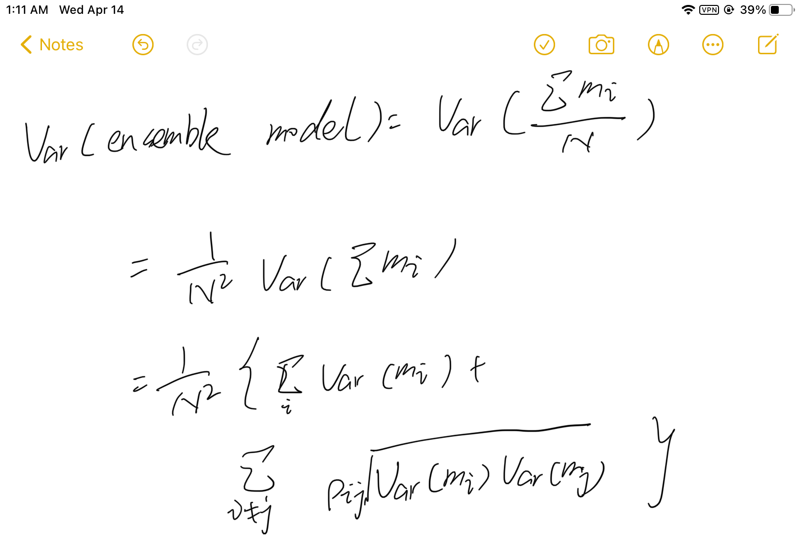

# emsemble_learning

## task-7 14th Apr. 打卡

### voting and bagging

### 为什么voting能让模型表现更好呢？
- model performance depends on bias and variance
- voting won't deteriorate nor improve model bias but it helps reduce 
variance 
  - why? Var(emsemble model) = 1/N Var(meta models)
  - assume we are emsembling by mean
    
但是上述公式成立的条件是 1 emsemble by mean 2 mega models are indepedent

## task-8 17th Apr. 打卡
### 为什么bagging能让模型表现更好呢？
在实际操作中，所有的模型都是condition on training data的，那怎么做才能增加model
independence呢？
- bagging! 
- every meta model is conditioning on a bootstapped training data

所以 rho 越小，模型的方差越小，因此为了减少模型方差，使用了bagging,让每一个meta model
所对应的训练数据是不一样的，因而降低了模型间的相关性。

### 采样参数
bootstrap是行采样，还有列采样，列采样是随机抽取feature，然后基于抽取的feature进行训练。
列采样可以使得模型间的相关性更小，从而降低了ensemble model的方差。

列采样的关键参数是抽取多少列feature呢？
根据Breiman (2001) （Breiman是随机森林的发明者）， classification tree应当抽取 $\sqrt{k}$, k是特征数量 
而regression tree可以抽取 k/3，因为"the corelation amongs regression trees increase much slower 
with features, compared to classification trees."
