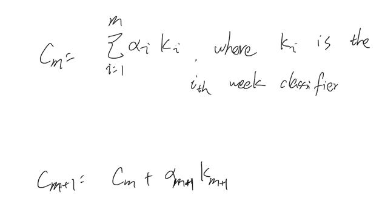
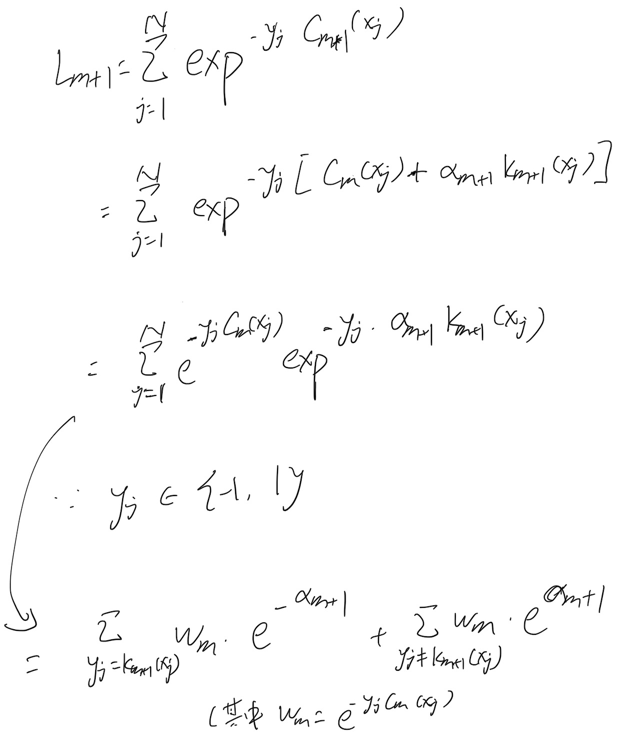
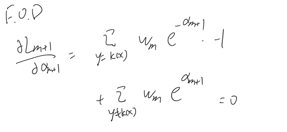
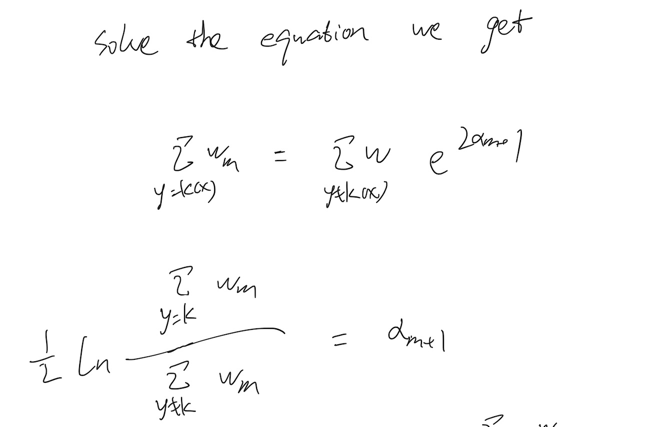
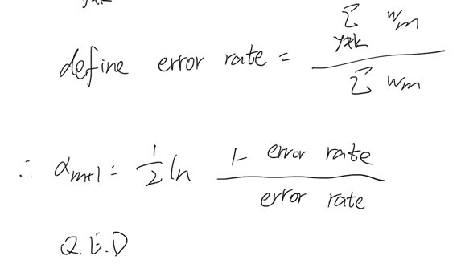
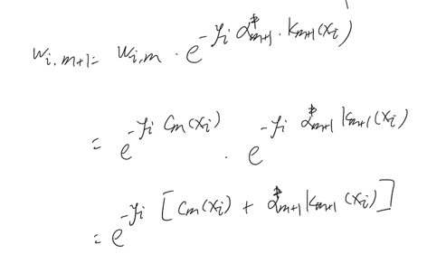

# emsemble_learning

## task-7 14th Apr. 打卡

### voting and bagging

### 为什么voting能让模型表现更好呢？
- model performance depends on bias and variance
- voting won't deteriorate nor improve model bias but it helps reduce 
variance 
  - why? Var(emsemble model) = 1/N Var(meta models)
  - assume we are emsembling by mean
    
但是上述公式成立的条件是 1 emsemble by mean 2 mega models are indepedent

## task-8 17th Apr. 打卡
### 为什么bagging能让模型表现更好呢？
在实际操作中，所有的模型都是condition on training data的，那怎么做才能增加model
independence呢？
- bagging! 
- every meta model is conditioning on a bootstapped training data

所以 rho 越小，模型的方差越小，因此为了减少模型方差，使用了bagging,让每一个meta model
所对应的训练数据是不一样的，因而降低了模型间的相关性。

### 采样参数
bootstrap是行采样，还有列采样，列采样是随机抽取feature，然后基于抽取的feature进行训练。
列采样可以使得模型间的相关性更小，从而降低了ensemble model的方差。

列采样的关键参数是抽取多少列feature呢？
 
根据Breiman (2001) （Breiman是随机森林的发明者), classification tree应当抽取 square root of k, k是特征数量 
而regression tree可以抽取 k/3，因为"the correlation amongst regression trees increase much slower 
with features, compared to classification trees."

## task-9 21st Apr. 打卡
Adaptative boosting中很有意思的一点是：为什么weaker learner的权重是 0.5 ln(1-error rate)/error rate

这个权重是基于最小化exponential loss的F.O.C推导而出的。

设定Y的range是{-1, 1}

Supposed we have a boosted classifier with m weak classifiers, denoted Cm

The exponental loss of adding one more weak classifier is 

First order condition is 

Sovle the F.O.C, we get 

Finaly, define error rate to be 

所以，其实error rate的定义和每个week learner的权重都是通过最优化loss function得到的。

至于为什么在新添加一颗树后，需要用上文推到的model权重再来调整每个observation的权重，
其实这只是在计算添了一棵树之后的新模型的exponential loss，推导如下：

所以其实Adaptive Boosting就是 -> 按照最小化exponential loss添加新的树 -> 
计算添加了一棵树后的新模型的exponential loss(表现为调整observation的权重) -> 
新一轮的添加树。

所以一旦loss function改变了——比如用了pseudo huber loss,那么权重调整的参数都会相应调整。

